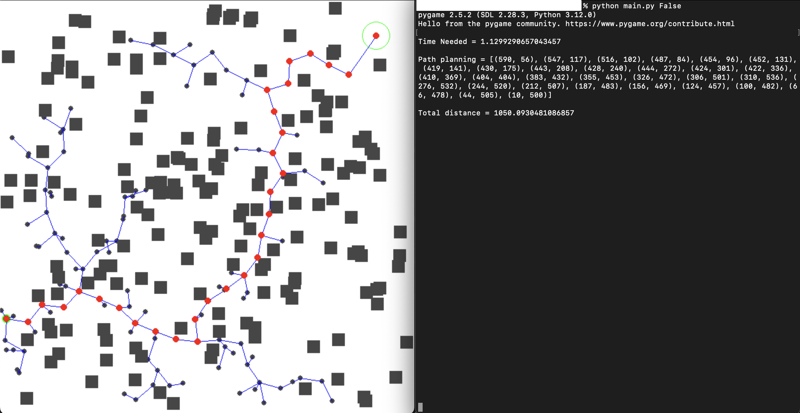

# Rapidly-Exploring-Random-Trees
## Setup Environment

1. Clone this repo.

```terminal
git clone https://github.com/Nivilian/Rapidly-Exploring-Random-Trees.git
```
2. Use Python 3.11 and install the required libraries.

```terminal
pip install -r requirements.txt
```

## Simulation

By default, this script will always generate new obstacles.

- To generate new obstacles:
```
python3 main.py 
```
- To use existing obstacles:
```
python3 main.py False
```

## demo and explaination

1. You can run the code multiple times using the same set of obstacles. It might yield various results, as shown in the graphs. But occasionally, it might not produce any result even with the same set of obstacles, and the code will return something with "index out of range". This behavior is driven by the algorithm rather than the code itself.


2. When it successfully produces a path, it will display: [time cost, path planning, total distance] as the output.

